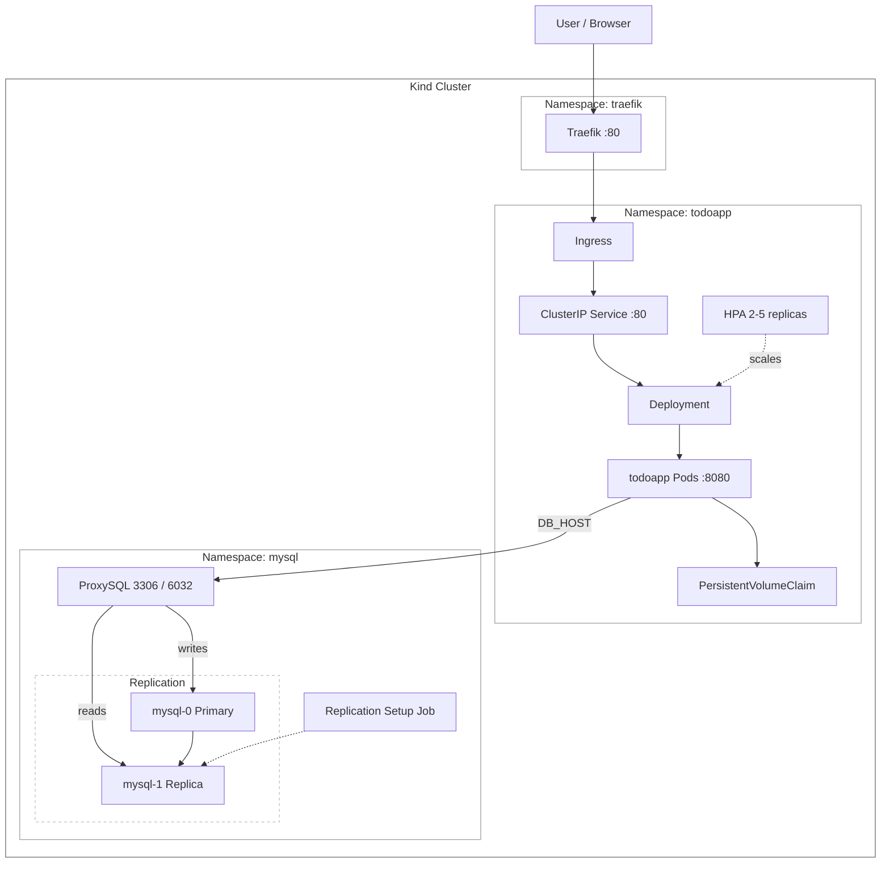
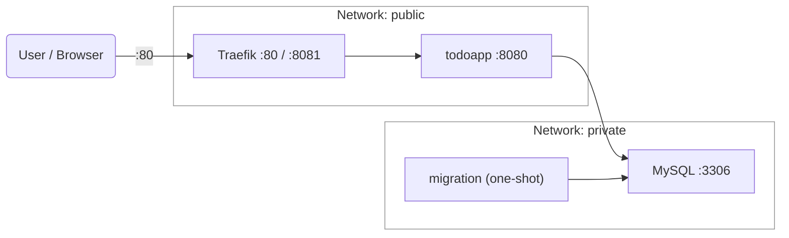
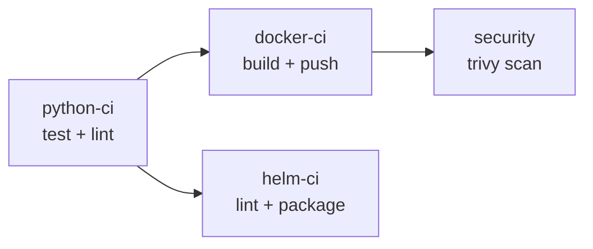

# Django Todolist

A Django-based todo list application with full Kubernetes deployment support, MySQL replication, ProxySQL load balancing, and Traefik ingress.

---

## Table of Contents

- [Architecture](#architecture)
- [File Structure](#file-structure)
- [Prerequisites](#prerequisites)
- [Quick Start (Docker Compose)](#quick-start-docker-compose)
- [Kubernetes Deployment](#kubernetes-deployment)
- [Helm Chart](#helm-chart)
- [CI/CD](#cicd)

---

## Architecture

### Kubernetes Cluster



### Docker Compose (local dev)



---

## File Structure

```
django-todolist/
├── cluster.yml                        # Kind cluster config (1 control-plane + 6 workers)
├── bootstrap.sh                       # One-command cluster setup script
├── docker-compose.yaml                # Local development stack
├── .env                               # Environment variables (not committed)
├── .env-example                       # Environment variables template
├── .gitlab-ci.yml                     # GitLab CI/CD pipeline
├── .github/
│   └── workflows/
│       └── main.yml                   # GitHub Actions pipeline
│
├── src/                               # Django application source
│   ├── Dockerfile                     # Multi-stage Docker build
│   ├── entrypoint.sh                  # Container entrypoint
│   ├── manage.py
│   ├── requirements.txt
│   ├── requirements-dev.txt
│   ├── accounts/                      # Auth app (login, register)
│   ├── lists/                         # Core todo app
│   ├── api/                           # REST API
│   └── todolist/                      # Django project settings
│
└── infrastructure/
    └── todoapp/                       # Parent Helm chart
        ├── Chart.yaml
        ├── Chart.lock
        ├── values.yaml                # Non-sensitive values
        ├── secrets.yaml               # Secrets — not committed (.gitignore)
        ├── files/
        │   └── wait-for-db.py         # Init container script
        ├── templates/
        │   ├── ns.yml
        │   ├── deployment.yml
        │   ├── clusterIp.yml
        │   ├── ingress.yml
        │   ├── configMap.yml
        │   ├── secret.yml
        │   ├── pvc.yml
        │   ├── hpa.yml
        │   ├── migration-job.yml
        │   └── rbac.yml
        └── charts/
            └── mysql/                 # MySQL subchart
                ├── Chart.yaml
                ├── values.yaml        # Non-sensitive values
                ├── secrets.yaml       # Secrets — not committed (.gitignore)
                ├── files/
                │   ├── init.sh        # StatefulSet init script
                │   └── replication.sh # Replication setup script
                └── templates/
                    ├── ns.yml
                    ├── statefulSet.yml
                    ├── service.yml
                    ├── configMap.yml
                    ├── secret.yml
                    ├── replication-job.yml
                    ├── proxysql-deployment.yml
                    └── proxysql-configMap.yml
```

---

## Prerequisites

| Tool | Version |
|------|---------|
| Docker | 24+ |
| kind | 0.20+ |
| kubectl | 1.28+ |
| Helm | 3.12+ |

---

## Quick Start (Docker Compose)

```bash
# 1. Copy environment file
cp .env-example .env
# Edit .env with your values

# 2. Start the stack
docker compose up -d

# 3. Open in browser
open http://localhost
```

Traefik dashboard is available at `http://localhost:8081`.

---

## Kubernetes Deployment

Before running, copy and fill in the secrets files:

```bash
cp infrastructure/todoapp/secrets.yaml.example infrastructure/todoapp/secrets.yaml
cp infrastructure/todoapp/charts/mysql/secrets.yaml.example infrastructure/todoapp/charts/mysql/secrets.yaml
# Edit both files with real values
```

Then bootstrap the cluster:

```bash
chmod +x bootstrap.sh
./bootstrap.sh
```

This script will:
1. Delete existing `kind` cluster if present
2. Create a new cluster from `cluster.yml` (1 control-plane + 6 workers)
3. Load the `todoapp` image into the cluster
4. Install Traefik via Helm
5. Install the todoapp Helm chart (includes MySQL subchart)
6. Port-forward Traefik to `localhost:80`

### Verify deployment

```bash
kubectl get pods -A
kubectl get ingress -n todoapp
```

---

## Helm Chart

Secrets are kept out of version control. Pass them via a separate `-f secrets.yaml` file:

```bash
helm upgrade --install todoapp ./infrastructure/todoapp \
  --namespace todoapp \
  --create-namespace \
  -f infrastructure/todoapp/values.yaml \
  -f infrastructure/todoapp/secrets.yaml
```

### todoapp `values.yaml` key options

| Key | Default | Description |
|-----|---------|-------------|
| `todoapp.image.tag` | `1.0.8` | Application image tag |
| `todoapp.dbHost` | `proxysql.mysql.svc.cluster.local` | DB host for app |
| `todoapp.hpa.minReplicas` | `2` | Minimum pod replicas |
| `todoapp.hpa.maxReplicas` | `5` | Maximum pod replicas |
| `todoapp.hpa.targetCPUUtilizationPercentage` | `70` | HPA CPU threshold |
| `todoapp.pvc.storage` | `1Gi` | Persistent volume size |

### mysql `values.yaml` key options

| Key | Default | Description |
|-----|---------|-------------|
| `mysql.replicaCount` | `2` | Number of MySQL pods (primary + replica) |
| `mysql.database` | `app_db` | Database name |
| `mysql.pvc.storage` | `2Gi` | Storage per MySQL pod |

---

## CI/CD

The project includes both GitHub Actions (`.github/workflows/main.yml`) and GitLab CI (`.gitlab-ci.yml`) pipelines with the following stages:



| Stage | What it does |
|-------|-------------|
| `python-ci` | Runs tests with coverage, flake8 linting, complexity check |
| `docker-ci` | Builds and pushes Docker image to Docker Hub |
| `security` | Scans image for vulnerabilities with Trivy |
| `helm-ci` | Lints, templates, and packages the Helm chart |